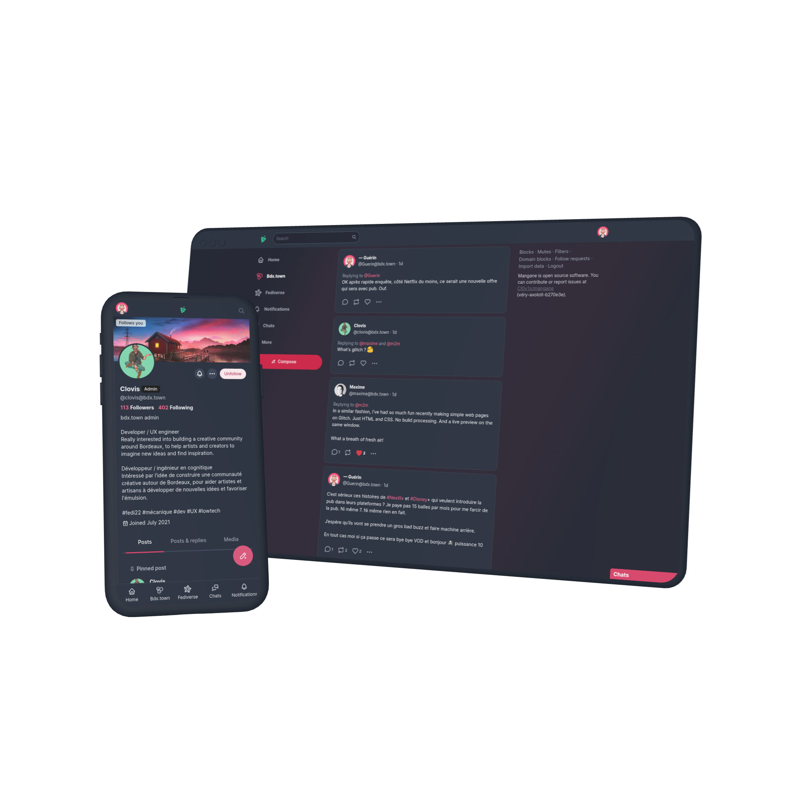
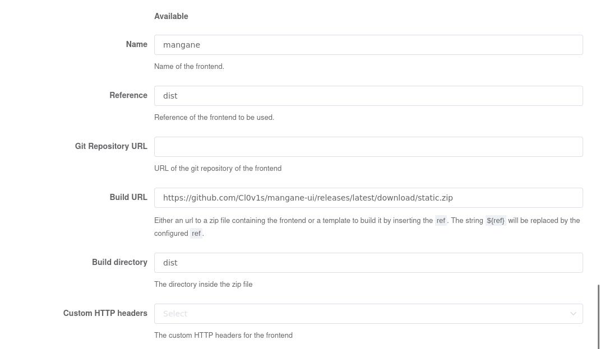
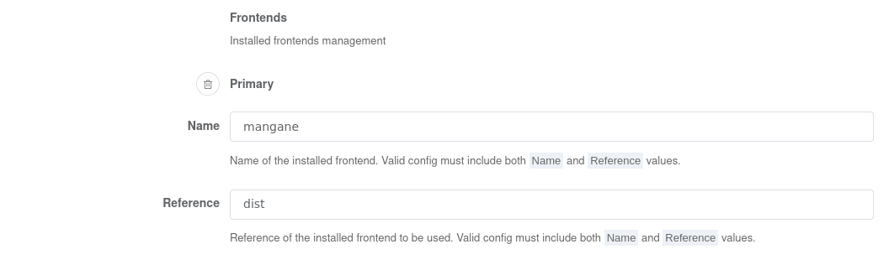

# Mangane FE





**Mangane FE** is a frontend for Pleroma with a focus on custom branding and ease of use.

## :rocket: Deploy on Pleroma/Akkoma

Installing Mangane FE on an existing Pleroma server is easy.
Log in your server and follow those instructions depending on your configuration.

### Download

First you need to download mangane on your server.

#### OTP

```
/opt/pleroma/bin/pleroma_ctl frontend install mangane --ref dist --build-url https://github.com/BDX-town/Mangane/releases/latest/download/static.zip
```
*Note: The pleroma_ctl path may vary on your system*

#### Mix / Source 

```
mix pleroma.frontend install mangane --ref dist --build-url https://github.com/BDX-town/Mangane/releases/latest/download/static.zip
```

#### Admin-fe with database configuration enabled

Just fill the form at Frontend/Available like this.



### Activation

Then you need to activate the frontend so it will be available to your users.

#### Config.exs

Edit your configuration files to add/edit the `config :pleroma, :frontends` section like this 

```
config :pleroma, :frontends,
  primary: %{
    "name" => "mangane",
    "ref" => "dist"
  }
```

##### Admin-fe with database configuration enabled

Just fill the form at Frontend/frontends/Primary like this.




**That's it!** :tada:
**Mangane FE is installed.**
The change will take effect immediately, just refresh your browser tab.
You may need to restart pleroma/akkoma for the change to take effect.

## :elephant: Deploy on Mastodon

See [Installing Mangane over Mastodon](https://docs.soapbox.pub/frontend/administration/mastodon/).

## How does it work?

Mangane FE is a [single-page application (SPA)](https://en.wikipedia.org/wiki/Single-page_application) that runs entirely in the browser with JavaScript.

It has a single HTML file, `index.html`, responsible only for loading the required JavaScript and CSS.
It interacts with the backend through [XMLHttpRequest (XHR)](https://developer.mozilla.org/en-US/docs/Web/API/XMLHttpRequest).

Here is a simplified example with Nginx:

```nginx
location /api {
  proxy_pass http://backend;
}

location / {
  root /opt/soapbox;
  try_files $uri index.html;
}
```

(See [`mastodon.conf`](https://github.com/BDX-town/Mangane/blob/master/installation/mastodon.conf) for a full example.)

Mangane incorporates much of the [Mastodon API](https://docs.joinmastodon.org/methods/), [Pleroma API](https://api.pleroma.social/), and more.
It detects features supported by the backend to provide the right experience for the backend.

# Running locally

To get it running, just clone the repo:

```sh
git clone https://github.com/BDX-town/Mangane.git
cd Mangane
```

Ensure that Node.js and Yarn are installed, then install dependencies:

```sh
yarn
```

Finally, run the dev server:

```sh
yarn dev
```

**That's it!** :tada:

It will serve at `http://localhost:3036` by default.

You should see an input box - just enter the domain name of your instance to log in.

Tip: you can even enter a local instance like `http://localhost:3000`!

### Troubleshooting: `ERROR: NODE_ENV must be set`

Create a `.env` file if you haven't already.

```sh
cp .env.example .env
```

And ensure that it contains `NODE_ENV=development`.
Try again.

## Developing against a live backend

You can also run Mangane FE locally with a live production server as the backend.

> **Note:** Whether or not this works depends on your production server. It does not seem to work with Cloudflare or VanwaNet.

To do so, just copy the env file:

## Local Dev Configuration

The following configuration variables are supported supported in local development.
Edit `.env` to set them.

All configuration is optional, except `NODE_ENV`.

#### `NODE_ENV`

The Node environment.
Mangane FE checks for the following options:

- `development` - What you should use while developing Mangane FE.
- `production` - Use when compiling to deploy to a live server.
- `test` - Use when running automated tests.

#### `BACKEND_URL`

URL to the backend server.
Can be http or https, and can include a port.
For https, be sure to also set `PROXY_HTTPS_INSECURE=true`.

**Default:** `http://localhost:4000`

#### `PROXY_HTTPS_INSECURE`

Allows using an HTTPS backend if set to `true`.

This is needed if `BACKEND_URL` is set to an `https://` value.
[More info](https://stackoverflow.com/a/48624590/8811886).

**Default:** `false`

# Yarn Commands

The following commands are supported.
You must set `NODE_ENV` to use these commands.
To do so, you can add the following line to your `.env` file:

```sh
NODE_ENV=development
```

#### Local dev server
- `yarn dev` - Run the local dev server.

#### Building
- `yarn build` - Compile without a dev server, into `/static` directory.

#### Translations
- `yarn manage:translations` - Normalizes translation files. Should always be run after editing i18n strings.

#### Tests
- `yarn test:all` - Runs all tests and linters.

- `yarn test` - Runs Jest for frontend unit tests.

- `yarn lint` - Runs all linters.

- `yarn lint:js` - Runs only JavaScript linter.

- `yarn lint:sass` - Runs only SASS linter.

# Contributing

We welcome contributions to this project.  To contribute, first review the [Contributing doc](docs/contributing.md)

Additional supporting documents include:
* [Mangane History](docs/history.md)
* [Redux Store Map](docs/history.md)

# Customization

Mangane supports customization of the user interface, to allow per instance branding and other features.  Current customization features include:

* Instance name
* Site logo
* Favicon
* About page
* Terms of Service page
* Privacy Policy page
* Copyright Policy (DMCA) page
* Promo panel list items, e.g. blog site link
* Mangane extensions, e.g. Patron module
* Default settings, e.g. default theme

Customization details can be found in the [Customization doc](docs/customization.md)

# License & Credits

Mangane FE is based on [Soapbox](https://soapbox.pub)'s frontend.

- `static/sounds/chat.mp3` and `static/sounds/chat.oga` are from [notificationsounds.com](https://notificationsounds.com/notification-sounds/intuition-561) licensed under CC BY 4.0.

Mangane FE is free software: you can redistribute it and/or modify
it under the terms of the GNU Affero General Public License as published by
the Free Software Foundation, either version 3 of the License, or
(at your option) any later version.

Mangane FE is distributed in the hope that it will be useful,
but WITHOUT ANY WARRANTY; without even the implied warranty of
MERCHANTABILITY or FITNESS FOR A PARTICULAR PURPOSE.  See the
GNU Affero General Public License for more details.

You should have received a copy of the GNU Affero General Public License
along with Mangane FE.  If not, see <https://www.gnu.org/licenses/>.
