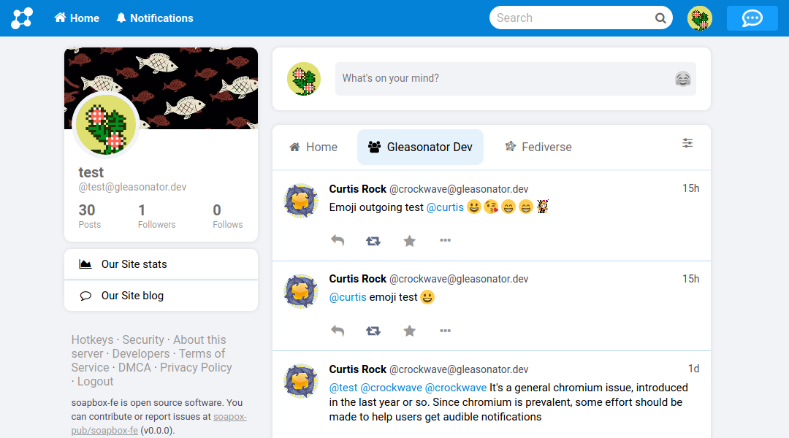

# Soapbox FE



**Soapbox FE** is a frontend for Pleroma with a focus on custom branding and ease of use.
It's part of the [Soapbox](https://soapbox.pub) project.

# :rocket: Deploy on Pleroma

Installing Soapbox FE on an existing Pleroma server is extremely easy.
Just ssh into the server and download a .zip of the latest build:

```sh
curl -L https://gitlab.com/soapbox-pub/soapbox-fe/-/jobs/artifacts/v1.3.0/download?job=build-production -o soapbox-fe.zip
```

Then unpack it into Pleroma's `instance` directory:

```sh
busybox unzip soapbox-fe.zip -o -d /opt/pleroma/instance
```

**That's it!** :tada:
**Soapbox FE is installed.**
The change will take effect immediately, just refresh your browser tab.
It's not necessary to restart the Pleroma service.

To remove Soapbox FE and revert to the default pleroma-fe, simply `rm /opt/pleroma/instance/static/index.html` (you can delete other stuff in there too, but be careful not to delete your own HTML files).

## How does it work?

Soapbox FE is a [single-page application (SPA)](https://en.wikipedia.org/wiki/Single-page_application) that runs entirely in the browser with JavaScript.

It has a single HTML file, `index.html`, responsible only for loading the required JavaScript and CSS.
It interacts with the backend through [XMLHttpRequest (XHR)](https://developer.mozilla.org/en-US/docs/Web/API/XMLHttpRequest).

It incorporates much of the [Mastodon API](https://docs.joinmastodon.org/methods/) used by Pleroma and Mastodon, but requires many [Pleroma-specific features](https://docs-develop.pleroma.social/backend/API/differences_in_mastoapi_responses/) in order to function.

# Running locally

To get it running, just clone the repo:

```sh
git clone https://gitlab.com/soapbox-pub/soapbox-fe.git
cd soapbox-fe
```

Ensure that Node.js and Yarn are installed, then install dependencies:

```sh
yarn
```

Finally, run the dev server:

```sh
yarn dev
```

**That's it!** :tada:

It will serve at `http://localhost:3036` by default.

It will proxy requests to the backend for you.
For Pleroma running on `localhost:4000` (the default) no other changes are required, just start a local Pleroma server and it should begin working.

### Troubleshooting: `ERROR: NODE_ENV must be set`

Create a `.env` file if you haven't already.

```sh
cp .env.example .env
```

And ensure that it contains `NODE_ENV=development`.
Try again.

## Developing against a live backend

You can also run Soapbox FE locally with a live production server as the backend.

> **Note:** Whether or not this works depends on your production server. It does not seem to work with Cloudflare or VanwaNet.

To do so, just copy the env file:

```sh
cp .env.example .env
```

And edit `.env`, setting the configuration like this:

```sh
BACKEND_URL="https://pleroma.example.com"
PROXY_HTTPS_INSECURE=true
```

You will need to restart the local development server for the changes to take effect.

## Local Dev Configuration

The following configuration variables are supported supported in local development.
Edit `.env` to set them.

All configuration is optional, except `NODE_ENV`.

#### `NODE_ENV`

The Node environment.
Soapbox FE checks for the following options:

- `development` - What you should use while developing Soapbox FE.
- `production` - Use when compiling to deploy to a live server.
- `test` - Use when running automated tests.

#### `BACKEND_URL`

URL to the backend server.
Can be http or https, and can include a port.
For https, be sure to also set `PROXY_HTTPS_INSECURE=true`.

**Default:** `http://localhost:4000`

#### `PROXY_HTTPS_INSECURE`

Allows using an HTTPS backend if set to `true`.

This is needed if `BACKEND_URL` is set to an `https://` value.
[More info](https://stackoverflow.com/a/48624590/8811886).

**Default:** `false`

# Yarn Commands

The following commands are supported.
You must set `NODE_ENV` to use these commands.
To do so, you can add the following line to your `.env` file:

```sh
NODE_ENV=development
```

#### Local dev server
- `yarn dev` - Run the local dev server.

#### Building
- `yarn build` - Compile without a dev server, into `/static` directory.

#### Translations
- `yarn manage:translations` - Normalizes translation files. Should always be run after editing i18n strings.

#### Tests
- `yarn test` - Runs all tests.

- `yarn test:lint` - Runs all linter tests.

- `yarn test:lint:js` - Runs only JavaScript linter.

- `yarn test:lint:sass` - Runs only SASS linter.

- `yarn test:jest` - Frontend unit tests.

# Contributing

We welcome contributions to this project.  To contribute, first review the [Contributing doc](docs/contributing.md)

Additional supporting documents include:
* [Soapbox History](docs/history.md)
* [Redux Store Map](docs/history.md)

# Customization

Soapbox supports customization of the user interface, to allow per instance branding and other features.  Current customization features include:

* Instance name
* Site logo
* Favicon
* About page
* Terms of Service page
* Privacy Policy page
* Copyright Policy (DMCA) page
* Promo panel list items, e.g. blog site link
* Soapbox extensions, e.g. Patron module
* Default settings, e.g. default theme

Customization details can be found in the [Customization doc](docs/customization.md)

# License & Credits

Soapbox FE is based on [Gab Social](https://code.gab.com/gab/social/gab-social)'s frontend which is in turn based on [Mastodon](https://github.com/tootsuite/mastodon/)'s frontend.

- `static/sounds/chat.mp3` and `static/sounds/chat.oga` are from [notificationsounds.com](https://notificationsounds.com/notification-sounds/intuition-561) licensed under CC BY 4.0.

Soapbox FE is free software: you can redistribute it and/or modify
it under the terms of the GNU Affero General Public License as published by
the Free Software Foundation, either version 3 of the License, or
(at your option) any later version.

Soapbox FE is distributed in the hope that it will be useful,
but WITHOUT ANY WARRANTY; without even the implied warranty of
MERCHANTABILITY or FITNESS FOR A PARTICULAR PURPOSE.  See the
GNU Affero General Public License for more details.

You should have received a copy of the GNU Affero General Public License
along with Soapbox FE.  If not, see <https://www.gnu.org/licenses/>.
