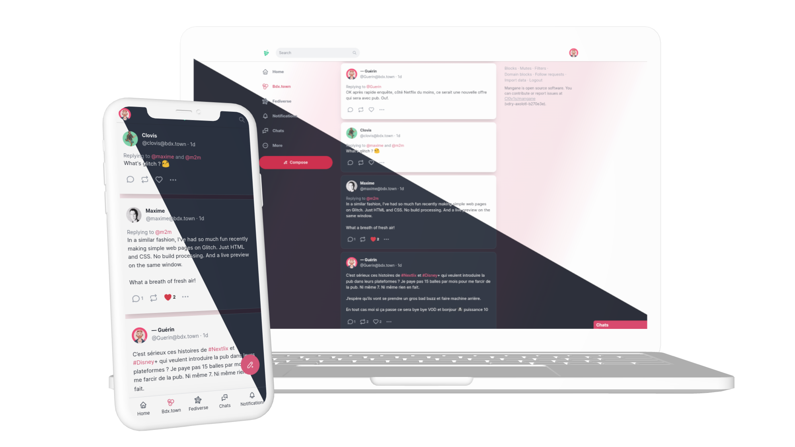
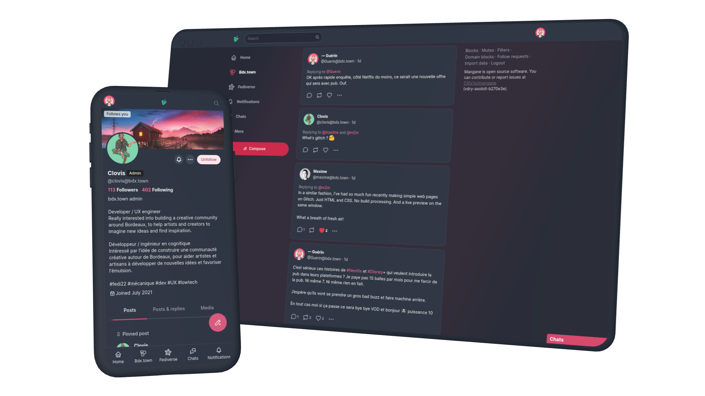
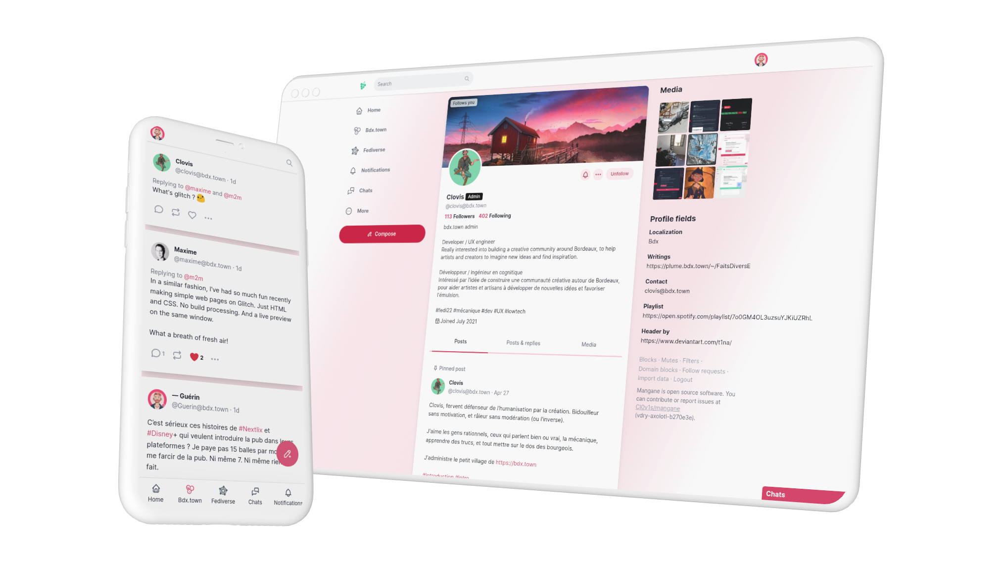
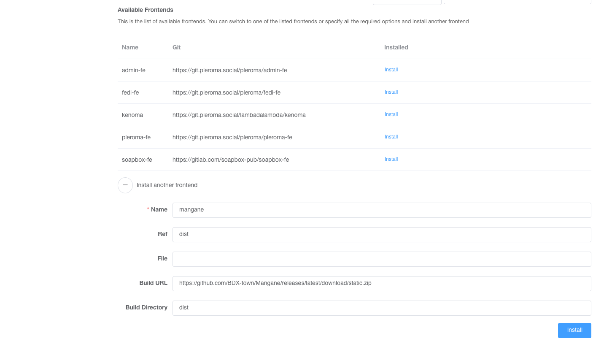
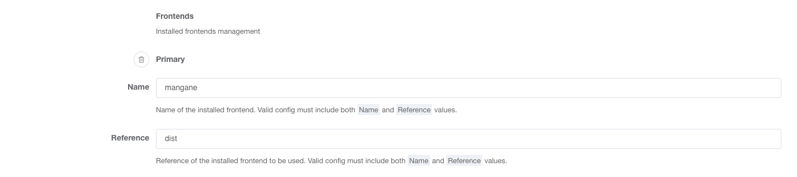

Mangane is an alternative frontend for Pleroma, Akkoma and Mastodon with a focus on ease of use, readability and custom branding.

This project is developped for [BDX-town](http://bdx.town/) Akkoma instance. Akkoma is a fork of Pleroma who mostly adds features, exposing them through new API endpoints. As of today, Akkoma and Pleroma API are compatible.

Mangane inherit from Pleroma the native large compatibility with Mastodon API.

Moreover, Mangane already has a feature detection system allowing us to adapt the experience following what platform is used as a backend.

We are speaking about Akkoma here since we are planning to add Akkoma specific features to the project without breaking any existing compatibility.

## Manifesto

Mangane is a fork of an existing project driven by a fundamental disagreement regarding the opinions and actions of its maintainer. This manifesto serves as a declaration of our motivations and the principles that guide the development of Mangane.

### Our Vision
Mangane aims to provide a more accessible interface compared to the majority of existing software interfaces. We recognize that many platforms overlook the importance of user-friendliness and fail to incorporate familiar design patterns that users are accustomed to. By leveraging well-established user interface conventions, we strive to create an inclusive environment that welcomes users from diverse backgrounds and skill levels.

### Supporting Akkoma and Promoting Sustainability
One of the primary reasons Mangane embraces Akkoma is because of its alignment with our software's objectives. Akkoma has been chosen not only for its capabilities but also because it can operate efficiently on modest hardware configurations. This choice reflects our commitment to energy efficiency and sustainability, allowing users to engage with technology while minimizing their environmental impact.

### Transparency and Accountability
We understand the importance of demonstrating our good intentions and the integrity of our project. To that end, we invite interested parties to explore the following resources as evidence of our commitment to ethical practices:

* [Manifesto of bdx.town (available in French)](https://bdx.town/about)
* [Rules of bdx.town (available in French)](https://bdx.town/about/rules)
* [Publicly accessible blocklist of bdx.town](https://bdx.town/api/v1/instance) (pleroma -> metadata -> federation -> mrf_simple -> reject)

These resources provide insight into the principles upheld by the individuals involved in Mangane and showcase our dedication to creating a safe and respectful digital environment.





## How does it work?

Mangane is a [single-page application (SPA)](https://en.wikipedia.org/wiki/Single-page_application) that runs entirely in the browser with JavaScript.

It has a single HTML file, `index.html`, responsible only for loading the required JavaScript and CSS.
It interacts with the backend through [XMLHttpRequest (XHR)](https://developer.mozilla.org/en-US/docs/Web/API/XMLHttpRequest).

Here is a simplified configuration example with Nginx:

```nginx
location /api {
  proxy_pass http://backend;
}

location / {
  root /opt/mangane;
  try_files $uri index.html;
}
```

(See [`mastodon.conf`](https://github.com/BDX-town/Mangane/blob/master/installation/mastodon.conf) file for a full example.)

Mangane incorporates much of the [Mastodon API](https://docs.joinmastodon.org/methods/), [Pleroma API](https://api.pleroma.social/), and more.
It detects features supported by the backend to provide the right experience for the backend.

# :rocket: Deploy on Pleroma/Akkoma

Installing Mangane on an existing Pleroma or Akkoma instance is easy.
Log in with SSH your server and follow those instructions depending on your configuration.

## Download

First you need to download Mangane on your server.

#### For OTP install

```sh
/opt/pleroma/bin/pleroma_ctl frontend install mangane --ref dist --build-url https://github.com/BDX-town/Mangane/releases/latest/download/static.zip
```
*Note: The pleroma_ctl path may vary on your system, if you are using Akkoma it's probably in /opt/akkoma/bin/*

#### For Mix/Source install

```sh
mix pleroma.frontend install mangane --ref dist --build-url https://github.com/BDX-town/Mangane/releases/latest/download/static.zip
```

#### With Admin FE 

If database configuration is enabled, you can also install Mangane from the Admin interface of Pleroma/Akkoma. 
Just fill the form at Frontend/Available like this.



### Activation

Then you need to activate the frontend so it will be available to your users.

#### With Config.exs file

Edit your configuration files to add/edit the `config :pleroma, :frontends` section like this 

```
config :pleroma, :frontends,
  primary: %{
    "name" => "mangane",
    "ref" => "dist"
  }
```

#### With Admin FE (database configuration enabled)

Just fill the form at Frontend/frontends/Primary like this.




**That's it!** :tada:

Mangane is now installed.
The change will take effect immediately, just refresh your browser tab, and Mangane will replace the default Pleroma FE or Akkoma FE interface. 
You may need to restart Pleroma/Akkoma for the change to take effect.

If you notice some issue with UI colors, please take a look at the Troubleshooting section.

## Install in other environments

#### Yunohost server

If you use Akkoma or Pleroma packaged application for [Yunohost](https://yunohost.org), a Debian system dedicated to self hosting, you can install Mangane from the command line `pleroma_ctl`) or with Pleroma’s admin interface (Admin FE). More instructionh can be found in [Installing on Yunohost](./docs/administration/yunohost.md) documentation page.

#### Deploy on Mastodon

Mangane is developed and tested only for Pleroma and Akkoma, this mean that there is _no_ explicit support to be installed as a frontend for a Mastodon instance.  If you want to try anyway, procede with caution.

# Upgrade

To upgrade Mangane, run the install commands again, on top of actual version.

```
/opt/pleroma/bin/pleroma_ctl frontend install mangane --ref dist --build-url https://github.com/BDX-town/Mangane/releases/latest/download/static.zip
```

If you want, you can also upgrade from the admin interface (Admin FE), doing a _new_ installation.

# Running locally

To get it running, just clone the repo:

```sh
git clone https://github.com/BDX-town/Mangane.git
cd Mangane
```

Ensure that Node.js and Yarn are installed, then install dependencies:

```sh
yarn
```

Finally, run the dev server:

```sh
yarn dev
```

**That's it!** :tada:

It will serve at `http://localhost:3036` by default.

You should see an input box - just enter the domain name of your instance to log in.

Tip: you can even enter a local instance like `http://localhost:3000`!

### Troubleshooting: `ERROR: NODE_ENV must be set`

Create a `.env` file if you haven't already.

```sh
cp .env.example .env
```

And ensure that it contains `NODE_ENV=development`.
Try again.

## Developing against a live backend

You can also run Mangane FE locally with a live production server as the backend.

> **Note:** Whether or not this works depends on your production server. It does not seem to work with Cloudflare or VanwaNet.

To do so, just copy the env file:

## Local Dev Configuration

The following configuration variables are supported supported in local development.
Edit `.env` to set them.

All configuration is optional, except `NODE_ENV`.

#### `NODE_ENV`

The Node environment.
Mangane checks for the following options:

- `development` - What you should use while developing Mangane FE.
- `production` - Use when compiling to deploy to a live server.
- `test` - Use when running automated tests.

#### `BACKEND_URL`

URL to the backend server.
Can be http or https, and can include a port.
For https, be sure to also set `PROXY_HTTPS_INSECURE=true`.

**Default:** `http://localhost:4000`

#### `PROXY_HTTPS_INSECURE`

Allows using an HTTPS backend if set to `true`.

This is needed if `BACKEND_URL` is set to an `https://` value.
[More info](https://stackoverflow.com/a/48624590/8811886).

**Default:** `false`

# Yarn Commands

The following commands are supported.
You must set `NODE_ENV` to use these commands.
To do so, you can add the following line to your `.env` file:

```sh
NODE_ENV=development
```

#### Local dev server
- `yarn dev` - Run the local dev server.

#### Building
- `yarn build` - Compile without a dev server, into `/static` directory.

#### Translations
- `yarn manage:translations` - Normalizes translation files. Should always be run after editing i18n strings.

#### Tests
- `yarn test:all` - Runs all tests and linters.

- `yarn test` - Runs Jest for frontend unit tests.

- `yarn lint` - Runs all linters.

- `yarn lint:js` - Runs only JavaScript linter.

- `yarn lint:sass` - Runs only SASS linter.

# Contributing

We welcome contributions to this project. To contribute, first review the [Contributing doc](docs/contributing.md)

Additional supporting documents include:
* [Mangane History](docs/history.md)
* Redux Store Map

# Customization

Mangane supports customization of the user interface, to allow per instance branding and other features. Current customization features include:

* Instance name, site logo and favicon.
* Custom pages: e.g About, Terms of Service page, Privacy Policy page, Copyright Policy (DMCA).
* Promo panel custom links (e.g. link to blog or documentation external site).
* Mangane extensions.
* Default instance settings (e.g. default theme).

Customization details can be found in the [Customization documentation](docs/customization.md)

# Troubleshooting

## Unable to upload some files (notably svg files)

It's a [known issue](https://git.pleroma.social/pleroma/pleroma/-/issues/2768#note_97928) with the `exiftool` filter.
To solve these upload problems, go to your admin-fe, search the upload section and remove `exiftool` from the enabled filters.

## Messy colors / style configuration

Akkoma recently changed their Content Security Policy (Content-Secutiry-Policy HTTP response header) to make it more strict.
If you notice any issue with your UI style configuration, please update your HTTP server configuration to override Akkoma's CSP header so the `style-src` section is set to `'self' 'unsafe-inline';`

Here is an example configuration for nginx:
```
# add style-src for mangane
proxy_hide_header Content-Security-Policy;
add_header Content-Security-Policy "upgrade-insecure-requests;script-src 'self';connect-src 'self' blob: https://example.com wss://example.com;media-src 'self' https:;img-src 'self' data: blob: https:;default-src 'none';base-uri 'self';frame-ancestors 'none';style-src 'self' 'unsafe-inline';font-src 'self';manifest-src 'self';" always;
```
*Please replace https://example.com with your own domain*

# License & Credits

Mangane is free software: you can redistribute it and/or modify
it under the terms of the GNU Affero General Public License as published by
the Free Software Foundation, either version 3 of the License, or
(at your option) any later version.

Mangane is distributed in the hope that it will be useful,
but WITHOUT ANY WARRANTY; without even the implied warranty of
MERCHANTABILITY or FITNESS FOR A PARTICULAR PURPOSE.  See the
GNU Affero General Public License for more details.

You should have received a copy of the GNU Affero General Public License
along with Mangane.  If not, see <https://www.gnu.org/licenses/>.

Mangane make use of code from other opensource and free software under various licenses:

- Mangane is a fork of [Soapbox](https://soapbox.pub) a frontend for Rebased, Pleroma and Mastodon, licensed under AGPL v3 or later.

- `static/sounds/chat.mp3` and `static/sounds/chat.oga` are from [notificationsounds.com](https://notificationsounds.com/notification-sounds/intuition-561) licensed under CC BY 4.0.

- [Tailwind CSS](https://github.com/tailwindlabs/tailwindcss) licensed by Tailwindlab under the simple permissive MIT License.
